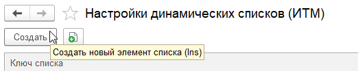
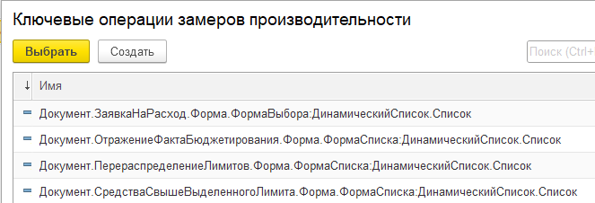
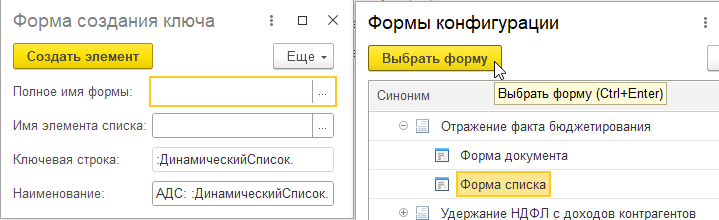
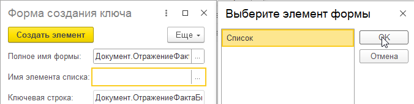
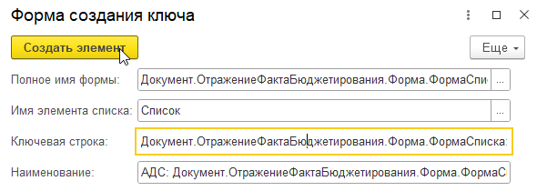

# Администрирование динамических списков

Расширение "Администрирование динамических списков" предназначено для настройки подключенных форм списка в режиме предприятия.

- [О подсистеме](#о-подсистеме)
- [Установка](#установка)
  - [Требования к конфигурации](#требования-к-конфигурации)
  - [Демонстрационное расширение](#демонстрационное-расширение)
  - [Внедрение](#внедрение)
- [Использование](#использование)
  - [Добавление настройки](#добавление-настройки)
  - [Перечень настроек](#перечень-настроек)
  - [Настройки ограничения полей](#настройки-ограничения-полей)
  - [История обновления списка](#история-обновления-списка)
  - [Запреты открытия](#запреты-открытия)
  - [Подмена источника](#подмена-источника)
  - [Переопределения](#переопределения)
- [Нюансы работы](#нюансы-работы)
- [В планах](#в-планах)
- [Заключение](#заключение)

## О подсистеме

Что даёт подсистема? Предположим, есть в системе некий тип документов. Их много, форма списка содержит сложный запрос, а пользователи любят применять неоптимальные настройки. Отбирать, сортировать и даже группировать по полям "через точку". И ответственный за подсистему решает, что пора ограничить возможности пользователей. Это и позволяет сделать подсистема прямо в режиме предприятия и без необходимости обновлять информационную базу.

Среди возможностей есть:

- Гибкая настройка ограничений использования полей в Отбора, Группировках и Сортировках
- Отключение возможности настройки Отборов, Группировок, Сортировок и Условного оформления
- Автоматическое отключение пользовательских настроек при открытии формы списка
- Установка периода при открытии формы списка
- Подмена свойств динамического списка (запрос, параметры, обязательные отборы и так далее)
- Запрет открытия формы по условиям
- Логирование пользовательских настроек в списках в истории для последующего анализа

Все изменения применяются в момент открытия формы с динамическим списком и не требует перезапуска сеанса.

## Установка

Актуальную версию можно скачать на странице релизов

Расширение универсальное и создано на основе БСП. Однако, в зависимости от целевой конфигурации, может потребоваться установка в режиме конфигуратора (с решением некоторых конфликтов свойств). Снимаются все галочки кроме "Активно".

### Требования к конфигурации

Подсистема требует наличие БСП в конфигурации

\+ На данный момент подсистема использует справочник Ключевые операции, поэтому хотя бы во время настройки необходимо включить подсистему БСП "Оценка производительности". Далее её можно отключить. Это необходимо, чтобы была активна функциональная опция, которая активирует справочник ключевых операций. Со временем от этого откажемся и перенесемм на независимый справочник.

### Демонстрационное расширение

Демо расширение содержит подключенный к подсистеме документ и справочник, на которых можно провести эксперименты настроек

### Внедрение

Для внедрения подсистемы необходимо в подключаемые формы списка внести вызовы методов подсистемы.

Это можно делать:

1. В самом расширении подсистемы
2. Непосредственно в конфигурации
3. В отдельном расширении

Первый способ самый удобный в использовании, но обновлять расширение придется далее вручную.  
При способах 2 и 3 лучше обращаться к модулям не напрямую, а через методы БСП `ОбщегоНазначения.ОбщийМодуль(ИмяМодуля)` и `ОбщегоНазначенияКлиент.ОбщийМодуль(ИмяМодуля)`

Пример можно увидеть в демо расширении

Для подключения формы списка необходимо доработать:

- В событии формы `ПриСозданииНаСервере` вызвать метод:

    ```bsl
    ИТМ_АдминистрированиеДинамическихСписков.ПриСозданииНаСервере(ЭтотОбъект);
    ```

- В событии элемента спика `ПередЗагрузкойПользовательскихНастроекНаСервере` вызвать метод:

    ```bsl
    ИТМ_АдминистрированиеДинамическихСписков.ПередЗагрузкойПользовательскихНастроекНаСервере(ЭтотОбъект, Элемент, Настройки, ИспользуютсяСтандартныеНастройки);
    ```

- В событии формы `ПриОткрытии` вызвать метод:

    ```bsl
    ИТМ_АдминистрированиеДинамическихСписковКлиент.ПриОткрытии(ЭтотОбъект, Отказ);
    ```

- Для оптимизации рекомендуется добавить на форму реквизит `НастройкиДинамическихСписков` с типом `Произвольный`  
        ⠀
- Чтобы работал механизм истории обновлений (его использовать не обязательно), необходимо дополнительно:
  - В событии элемента списка `ПриПолученииДанныхНаСервере` вызвать:

    ```bsl
    ИТМ_АдминистрированиеДинамическихСписков.ПриПолученииДанныхНаСервере(ИмяЭлемента, Настройки, Строки);
    ```

  - В событии формы `ПриЗакрытии` вызвать метод:

    ```bsl
    ИТМ_АдминистрированиеДинамическихСписковКлиент.ПриЗакрытии(ЭтотОбъект, ЗавершениеРаботы);
    ```

  - Добавить экспортный метод для обработчика ожидания:

    ```bsl
    &НаКлиенте
    Процедура ИТМ_ОбработатьНакопленныеСобытияОбновления() Экспорт
    ИТМ_АдминистрированиеДинамическихСписковКлиент.ОбработатьНакопленныеСобытияОбновления(ЭтотОбъект);
    КонецПроцедуры
    ```

## Использование

Все настройки подсистемы находятся в регистре сведений `Настройки динамических списков`. 
`e1cib/list/РегистрСведений.ИТМ_НастройкиДинамическихСписков`

### Добавление настройки

Для добавления новой настройки:

1. В списке нажимаем `Создать`
   \

2. Появляется форма списка с доступными ключевыми операциями. Этот справочник используется как ключ для настроек динамических списков. Поэтому, необходимо либо добавить новую ключевую операцию, либо выбрать существующую.

   
   ⠀⠀
   1. Для добавления ключевой операции нажимаем в списке `Создать`

      
      ⠀⠀
   2. Вводим полное имя формы (или выбираем из доступных)

      
      ⠀⠀
   3. Вводим имя элемента списка (или выбираем из доступных)

      
      ⠀⠀
   4. Нажимаем `Создать элемент`
      ⠀⠀
      
      ⠀⠀
3. Выбираем нужную ключевую операцию. В форме списка настроек появляется добавленная нами строка

### Перечень настроек

- **Применять настройки к списку** - Используются ли введенные ниже настройки
- **Основные**
  - **Отключать пользовательские настройки при открытии** - При открытии формы списка будут отключены пользовательские настройки
  - **...кроме** - Имена полей, которые не будут отключены при открытии
  - **Удалять недоступные поля настроек** - Стоит ли дополнительно удалять все недоступные элементы пользовательских настроек.
  - Например, изменились ограничения отборов. Но у пользователя в настройках остались отборы по теперь запрещенному полю. Такие отборы будут удалены. Или удалили какой-то реквизит документа. Но у пользователя в настройках остался отбор по нему. Такой отборы так же будет удален.
  - **Динамическое считывание данных** - Одноименное свойство динамического списка
  - **Автоматическое сохранение пользовательских настроек** - Одноименное свойство динамического списка
  - **Устанавливать период при открытии** - При открытии формы списка будет установлен указанный в настройке период
- **Источник**
  - **Использовать настройки источника** - Применяются ли настройки источника данных
  - **Основная таблица** - Одноименное свойство динамического списка
  - **Авто заполнение доступных полей** - Одноименное свойство динамического списка
  - **Получение представлений для невидимых полей** - Одноименное свойство динамического списка
  - **Текст запроса** - Одноименное свойство динамического списка
  - **Параметры** - Параметры динамического списка
  - **Отбор** - Отбор динамического списка
  - **Сортировка** - Сортировка динамического списка
- **Отбор**
  - **Использование настроек отбора** - Применяются ли настройки ограничений списка
  - **...кроме ролей** - Для этих ролей настройки применятся не будут
  - **Отключать пользовательские настройки при открытии** - При открытии формы списка будут отключены пользовательские настройки
  - **...кроме** - Имена полей, которые не будут отключены при открытии
  - **Исключить из меню "Настроить список"** - Исключить пункт "Отборы" из меню "Настроить список"
  - **Полный запрет по всем полям** - Полный запрет отборов по всем полям
  - **Запрещать по:**
    - **Ссылочным** - Запрещать по полям ссылочного типа
    - **Не индексируемым** - Запрещать по НЕ индексируемым полям
    - **Таблицам** - Запрещать по табличным частям
    - **Составным** - Запрещать по полям составного типа
    - **Подчиненным** - Запрещать по подчиненным полям
    - **Подчиненным не индексируемых** - Запрещать по подчиненным НЕ индексируемых полей
    - **Таблицам подчиненных** - Запрещать по табличным частям подчиненных полей
    - **Подчиненным составных** - Запрещать по подчиненным полям составных
  - **Исключения:**
    - **Запрещенные** - дополнительно запрещенные поля
    - **Разрешенные** - дополнительно разрешенные поля
- **Группировки**
  - **Использование настроек группировки** - Применяются ли настройки ограничений списка
  - **...кроме ролей** - Для этих ролей настройки применятся не будут
  - **Отключать пользовательские настройки при открытии** - При открытии формы списка будут отключены пользовательские настройки
  - **...кроме** - Имена полей, которые не будут отключены при открытии
  - **Исключить из меню "Настроить список"** - Исключить пункт "Группировка" из меню "Настроить список"
  - **Полный запрет по всем полям** - Полный запрет группировки по всем полям
  - **Запрещать по:**
    - **Ссылочным** - Запрещать по полям ссылочного типа
    - **Не индексируемым** - Запрещать по НЕ индексируемым полям
    - **Таблицам** - Запрещать по табличным частям
    - **Составным** - Запрещать по полям составного типа
    - **Подчиненным** - Запрещать по подчиненным полям
    - **Подчиненным не индексируемых** - Запрещать по подчиненным НЕ индексируемых полей
    - **Таблицам подчиненных** - Запрещать по табличным частям подчиненных полей
    - **Подчиненным составных** - Запрещать по подчиненным полям составных
  - **Исключения:**
    - **Запрещенные** - дополнительно запрещенные поля
    - **Разрешенные** - дополнительно разрешенные поля
- **Сортировка**
  - **Использование настроек сортировки** - Применяются ли настройки ограничений списка
  - **...кроме ролей** - Для этих ролей настройки применятся не будут
  - **Отключать пользовательские настройки при открытии** - При открытии формы списка будут отключены пользовательские настройки
  - **...кроме** - Имена полей, которые не будут отключены при открытии
  - **Исключить из меню "Настроить список"** - Исключить пункт "Сортировка" из меню "Настроить список"
  - **Полный запрет по всем полям** - Полный запрет сортировки по всем полям
  - **Запрещать по:**
    - **Ссылочным** - Запрещать по полям ссылочного типа
    - **Не индексируемым** - Запрещать по НЕ индексируемым полям
    - **Таблицам** - Запрещать по табличным частям
    - **Составным** - Запрещать по полям составного типа
    - **Подчиненным** - Запрещать по подчиненным полям
    - **Подчиненным не индексируемых** - Запрещать по подчиненным НЕ индексируемых полей
    - **Таблицам подчиненных** - Запрещать по табличным частям подчиненных полей
    - **Подчиненным составных** - Запрещать по подчиненным полям составных
  - **Исключения:**
    - **Запрещенные** - дополнительно запрещенные поля
    - **Разрешенные** - дополнительно разрешенные поля
- **Условное оформление**
  - **Использование настроек условного оформления** - Применяются ли настройки ограничений списка
  - **Отключать пользовательские настройки при открытии** - При открытии формы списка будут отключены пользовательские настройки
  - **...кроме** - Имена полей, которые не будут отключены при открытии
  - **Исключить из меню "Настроить список"** - Исключить пункт "Условного оформление" из меню "Настроить список"
- **История обновления**
  - **Фиксировать историю обновления** - Нужно ли фиксировать историю обновления динамического списка
  - **Частота записи (с.)** - Часто записи накопленной истории. Если 0, то история будет писаться сразу в событии получения данных ДС.
  - **Только при изменении настроек** - Стоит ли проверять настройки на изменение \
    _Ложь_ - записываться будет каждое событие обмена списка\
    _Истина_ - записываться будет только если настройки отличаются от прошлого события обновления списка в этой форме
  - **Фиксировать:**
    - **Все события** - Все события обновления списка
    - **Если есть группировки** - Фиксировать, если в настройках есть группировки
    - **Если есть сортировки** - Фиксировать, если в настройках есть сортировки
    - **Если есть отборы** - Фиксировать, если в настройках есть отборы
- **Запреты открытия**
  - **Использовать запреты открытия формы** - Позволяет установить запрет открытия формы в зависимости от условий
  - **...кроме ролей** - Запреты не будут распространяться на обладателей ролей
  - **Условия запрета** - Таблица с условиями, при которых должен происходить запрет открытия формы
- **Дополнительно** - Дополнительные значения, доступные в коде. Хранятся в соответствии.

### Настройки ограничения полей

Ограничения полей (на отборы, группировки, сортировки) можно устанавливать несколькими способами:

1. Полное ограничение. Таким образом можно, например, запретить полностью использование Группировок
2. Ограничение по признакам. Это, например, ограничение на НЕ индексируемые поля. Или подчиненные поля. Или табличные части. Все варианты можно комбинировать и использовать вместе.
3. Точечная настройка. Позволяет самостоятельно прописать те поля-исключения которые запрещены (или же наоборот разрешены в противовес остальных настроек). Для точечной настройки используется формат:
   - `ИмяПоля.*` - поле и его подчиненные
   - `ИмяПоля` - само поле (без подчиненных)
   - `ИмяПоля.ИмяПодчиненногоПоля` - конкретное подчиненное поле
   - `[Имя поля]` - доп. поле (доп. реквизит или свойство), подключаемое через Характеристики платформы
4. Изменение текста запроса. В подсистеме есть возможность полностью подменить текст запроса динамического списка. При помощи этого так же можно установить ограничения полей, используя конструкции расширения языка запросов СКД.

### История обновления списка

В подсистеме есть возможность фиксирования истории обновления динамических списков. \
К сожалению, ограничения платформы не позволяют определять скорость обновления ДС. \
Но подсистема дает возможность собрать сведения о самих выполняемых настройках пользователей.

История хранится в регистре сведений `История обновления динамических списков`.  
`e1cib/list/РегистрСведений.ИТМ_ИсторияОбновленияДинамическихСписков`

Как это работает: в событии `ПриПолученииДанныхНаСервере()` у динамического списка происходит фиксация текущих настроек.

Если в настройках установлена частота записи, то с заданной частотой происходит анализ открытых форм и сбор накопленных в них настройках, чтобы поместить в регистр сведений.

Если же в настройках частота записи пустая, то при каждом обновлении динамического списка будет происходить запись в регистр сведений.

### Запреты открытия

В подсистеме есть возможность установить запрет открытия формы.
При этом задается текст запрета и условия, при которых форму нельзя открыть.
На данный момент в условиях можно опираться на значения констант и параметров сеанса.

### Подмена источника

В подсистеме есть возможность подмены всех свойств динамического списка.
Например, если в запросе списка обнаружена ошибка или неоптимальность и её срочно нужно исправить, то для этого можно воспользоваться данным функционалом и переопределить текст запроса динамического списка.

### Переопределения

Подсистема имеет преопределяемые модули. В сочитаниям с возможностью в настройка списка указывать произвольные дополнительные значения, это позволяет добавлять свои ограничения и параметры работы списков

## Нюансы работы

Подсистема была разработана ещё до версии 8.3.19, в которой добавили расширенные возможности настройки полей динамического списка. Расширение использует методы `УстановитьОграниченияИспользования...()`

Помимо поддержки "прошлых" платформ и режимов совместимости, мы продолжаем использовать эти методы потому, что они позволяют точечно отключить доступность не только основных полей, но и конкретных подчиненных. Например, запретить отборы на подчиненные поля полей составного типа в таблице, но в исключениях добавить их Код.

## В планах

Все планы можно посмотреть на странице issues, но общие планируемые доработки:

- Отказаться от использование справочника КлючевыеОперации. Это позволит не включить подсистему Оценка производительности.
- Переделать периодическую фиксацию истории со своих методов на методы БСП. Это упростит подключение формы списка к подсистеме.
- Добавить возможности

Если у вас есть идеи, предложения или информация об ошибке, то мы будем рады вашему ишуизу.

## Заключение

По всем вопросам можете обращаться к разработчику [@Черненко Виталий](https://github.com/SeiOkami)